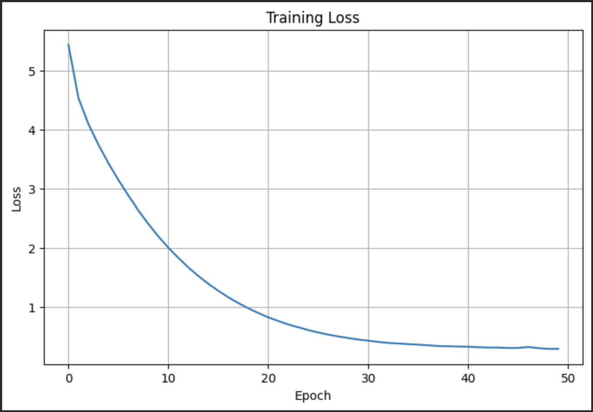
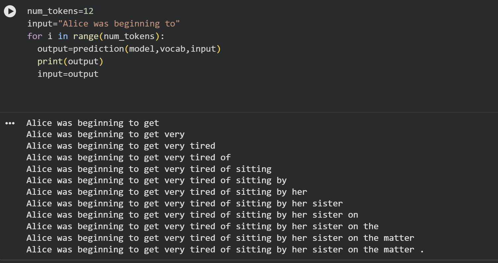

<h1 align="center">🧠 LSTM Next Word Predictor</h1>

<p align="center">
A PyTorch implementation of an <b>LSTM-based Next Word Prediction</b> model trained on the <b>Alice's Adventures in Wonderland</b> corpus.
</p>

<p align="center">


</p>

<p align="center">
⭐ Built from scratch using PyTorch as part of my Deep Learning & NLP learning journey.
</p>

---

# 📖 About the Project

This repository is part of **my learning journey in Deep Learning and Natural Language Processing (NLP).**

The objective of this project was to understand **how an LSTM learns language patterns** by predicting the next word in a sentence.

Instead of relying on high-level NLP frameworks, I implemented the complete workflow manually—from preprocessing raw text to training an LSTM language model and generating text one word at a time.

---

# ✨ Features

- Text preprocessing
- Tokenization using NLTK
- Vocabulary creation
- Unknown token handling (`<unk>`)
- Sequence generation
- Sequence padding
- Train-Test Split
- Custom PyTorch Dataset & DataLoader
- LSTM implementation from scratch
- Next Word Prediction
- Autoregressive text generation

---

# 🛠️ Tech Stack

| Category | Technologies |
|-----------|--------------|
| Language | Python |
| Deep Learning | PyTorch |
| NLP | NLTK |
| Data Processing | NumPy |
| Visualization | Matplotlib |
| Machine Learning Utilities | Scikit-Learn |

---

# 📚 Dataset

This model was trained on the public-domain novel **Alice's Adventures in Wonderland** by **Lewis Carroll**.

The corpus was converted into sequential training samples using a sliding-window approach, where the model learns to predict the next word given the previous words.

---

# 📂 Project Structure

```text
LSTM-Next-Word-Predictor/
│
├── data/
│   └── alice.txt
│
├── notebooks/
│   └── Next_word_LSTM.ipynb
│
├── models/
│   └── lstm_model.pth
│
├── images/
│   ├── training_loss.png
│   └── prediction_demo.png
│
├── requirements.txt
├── .gitignore
├── LICENSE
└── README.md
```

---

# 🏗️ Model Architecture

```text
Input Sequence
        │
        ▼
Embedding Layer
        │
        ▼
LSTM Layer
        │
        ▼
Fully Connected Layer
        │
        ▼
Softmax
        │
        ▼
Predicted Next Word
```

---

# 📈 Training Performance

The training loss consistently decreases throughout training, showing that the model successfully learns language patterns from the corpus.

<p align="center">

</p>

---

# 📊 Evaluation

| Metric | Result |
|---------|---------|
| Training Loss | **0.2433** |
| Training Accuracy | **93.16%** |
| Dataset | **Alice's Adventures in Wonderland** |
| Framework | **PyTorch** |

> Since this project focuses on language generation, qualitative examples are also included below to demonstrate the model's ability to generate coherent text.

---

# ✨ Example Prediction

### Input

```text
Alice was beginning to
```

### Generated Continuation

```text
Alice was beginning to get
Alice was beginning to get very
Alice was beginning to get very tired
Alice was beginning to get very tired of
Alice was beginning to get very tired of sitting
Alice was beginning to get very tired of sitting by
Alice was beginning to get very tired of sitting by her
Alice was beginning to get very tired of sitting by her sister
Alice was beginning to get very tired of sitting by her sister on
Alice was beginning to get very tired of sitting by her sister on the
Alice was beginning to get very tired of sitting by her sister on the matter
Alice was beginning to get very tired of sitting by her sister on the matter.
```

<p align="center">

</p>

---

# 📚 What I Learned

This project helped me gain practical experience with:

- NLP text preprocessing
- Tokenization and vocabulary creation
- Numerical text representation
- Sequence generation
- Sequence padding
- Custom Dataset and DataLoader creation
- Building LSTM models in PyTorch
- Language modeling
- Autoregressive text generation
- Training and evaluating deep learning models

---

# 🚀 Future Improvements

- [ ] Add Dropout Regularization
- [ ] Implement Multi-layer LSTM
- [ ] Compare performance with a GRU model
- [ ] Train on a larger text corpus
- [ ] Explore Beam Search decoding
- [ ] Build a Transformer-based next-word predictor
- [ ] Deploy as a simple web application

---

# ⚙️ Installation

Clone the repository

```bash
git clone https://github.com/Sanjay-jat/LSTM-Next-Word-Predictor.git
```

Move into the project directory

```bash
cd LSTM-Next-Word-Predictor
```

Install the required dependencies

```bash
pip install -r requirements.txt
```

Run the notebook

```text
notebooks/Next_word_LSTM.ipynb
```

---

# 💡 Note

This repository was created as a **learning project** to understand the fundamentals of **LSTMs**, **language modeling**, and **sequence prediction** using PyTorch.

The primary goal was to build the complete pipeline from scratch and strengthen my understanding of deep learning concepts. Feedback, suggestions, and improvements are always welcome!

---

# 🤝 Connect With Me

🔗 **GitHub:** https://github.com/Sanjay-jat

If you have suggestions, ideas, or feedback about this project, feel free to open an issue or connect with me.

---

<h3 align="center">🌟 Thanks for Visiting!</h3>

<p align="center">
If you found this project interesting or learned something from it, consider giving it a ⭐ on GitHub.
</p>